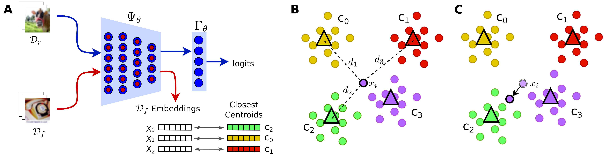
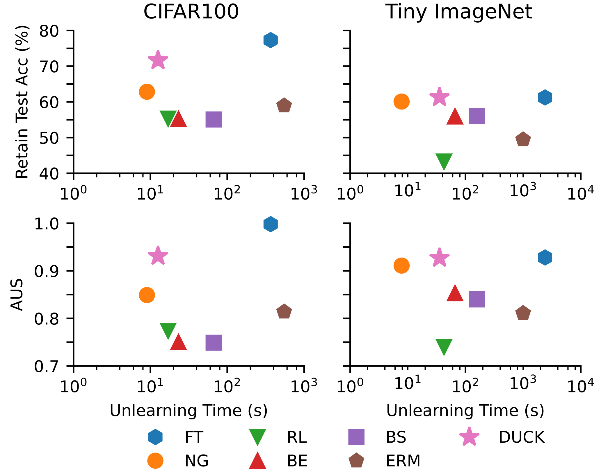

# DUCK: Distance-based Unlearning via Centroid Kinematics
[Marco Cotogni](https://scholar.google.com/citations?user=8PUz5lAAAAAJ&hl=it), [Jacopo Bonato](https://scholar.google.com/citations?user=tC1GFkUAAAAJ&hl=it&authuser=1), [Luigi Sabetta](), [Francesco Pelosin](https://scholar.google.com/citations?user=XJ9QvI4AAAAJ&hl=it&authuser=1) and [Alessandro Nicolosi]()

The paper is available on  [](https://arxiv.org/abs/2312.02052)
## Overview

DUCK is a cutting-edge machine unlearning algorithm designed to enhance privacy in modern artificial intelligence models. Leveraging the power of metric learning, DUCK efficiently removes residual influences of specific data subsets from a neural model's acquired knowledge during training.

## Features

- **Distance-based Unlearning**: DUCK employs distance metrics to guide the removal of samples matching the nearest incorrect centroid in the embedding space.

- **Versatile Performance**: Evaluated across various benchmark datasets, DUCK demonstrates exceptional performance in class removal and homogeneous sampling removal scenarios.

- **Adaptive Unlearning Score (AUS)**: Introducing a novel metric that not only measures the efficacy of unlearning but also quantifies the performance loss relative to the original model.

- **Membership Inference Attack**: DUCK includes a novel membership inference attack to assess its capacity to erase previously acquired knowledge, adaptable to future methodologies.

## Getting Started


### Installation

```bash
# Clone the repository
git clone https://github.com/OcraM17/DUCK

# Navigate to the project directory
cd your-repo

# Installation WITH DOCKER

#Step 1:

#Build the docker image from the Dockerfile : 
docker build -f Dockerfile -t duck:1.0 . 

#Step 2:

#Run your image : 
docker run -it --gpus all -v "/path_to_dataset_folder":/root/data -v "/path_to_duck_folder":/duck duck:1.0 /bin/bash

# Install LOCALLY 
pip install -r requirements.txt
```

## Code Execution
- Step 1:
      Run 'pyhton3 training_original.py' to train the original model. Choose the dataset in opts
-Step 2:
      Run 'sample_fgt_samples.py' to sample the forget sample for HR scenario
- Step 3:
      Run 'pyhton3 training_oracle.py' to train the retrained model. Choose the dataset in opts. Use --mode CR for class removal and --mode HR for homogeneus removal

If you already have trained and retrained model you can skip the above steps.

If you plan to execute the HR scenario,before launching any unlearning method, you have to execute the script sample_fgt_samples.py for generating the indices of the samples to be forgotten.

The organization of the project should be the followiing:
```
/project-root
  ├── src
  │   ├── models
  │   ├── forget_id_files
  │   ├── MIA_CODE
  │   ├── out
  │   │   ├── CR
  │   │   └── HR
  │   ├── weights
  │   │   ├── chks_cifar10
  │   │   ├── chks_cifar100
  │   │   ├── chks_tiny
  │   │   └── chks_vgg
  │   └── *files*.py
  ├── Dockerfile
  ├── requirements.txt  
  ├── README.md
  ├── LICENSE
  └── .gitignore
```

For reproducing the experiments:
```
cd src

python main_def.py --run_name <run_name> --dataset <dataset> --mode <mode> --cuda <cuda> --load_unlearned_model --save_model --save_df --push_results --run_original --run_unlearn --run_rt_model --num_workers <num_workers> --method <method> --model <model> --bsize <bsize> --wd <wd> --momentum <momentum> --lr <lr> --epochs <epochs> --scheduler <scheduler> --temperature <temperature> --lambda_1 <lambda_1> --lambda_2 <lambda_2>
```
Configuration Options:
 
    --run_name: Name of the run (default: "test").
    --dataset: Dataset for the experiment (default: "cifar100").
    --mode: Mode for the experiment (default: "CR").
    --cuda: Select zero-indexed CUDA device. Use -1 to run on CPU (default: 0).
    --load_unlearned_model: Load a pre-trained unlearned model.
    --save_model: Save the trained model.
    --save_df: Save the experiment results as a DataFrame.
    --push_results: push results on google docs
    --run_original: Run the original model.
    --run_unlearn: Run the unlearned model.
    --run_rt_model: Run the real-time model.
    --num_workers: Number of workers for data loading (default: 4).
    --method: Method for unlearning (default: "DUCK").
    --model: Model architecture (default: 'resnet18').
    --bsize: Batch size (default: 256).
    --wd: Weight decay (default: 0.0).
    --momentum: Momentum for SGD optimizer (default: 0.9).
    --lr: Learning rate (default: 0.0004).
    --epochs: Number of epochs (default: 200).
    --scheduler: Learning rate scheduler milestones (default: [25, 40]).
    --temperature: Temperature for unlearning algorithm (default: 2).
    --lambda_1: Lambda 1 hyperparameter (default: 1).
    --lambda_2: Lambda 2 hyperparameter (default: 1.4).

All the hyperparameters are reported in the Supplementary Material of the paper

Example CIFAR 10 in HR scenario
```bash
python3 main_def.py --run_name cifar10_HR --dataset cifar10 --mode HR --cuda 0 --save_model --save_df --run_unlearn  --num_workers 4 --method DUCK --model resnet18 --bsize 1024 --lr 0.001 --epochs 10  --temperature 2 --lambda_1 1 --lambda_2 1.4
```
## Results



## Citation
If you find our paper or our code useful for your research, please cite:
```
@misc{cotogni2023duck,
      title={DUCK: Distance-based Unlearning via Centroid Kinematics}, 
      author={Marco Cotogni and Jacopo Bonato and Luigi Sabetta and Francesco Pelosin and Alessandro Nicolosi},
      year={2023},
      eprint={2312.02052},
      archivePrefix={arXiv},
      primaryClass={cs.CV}
}
```
